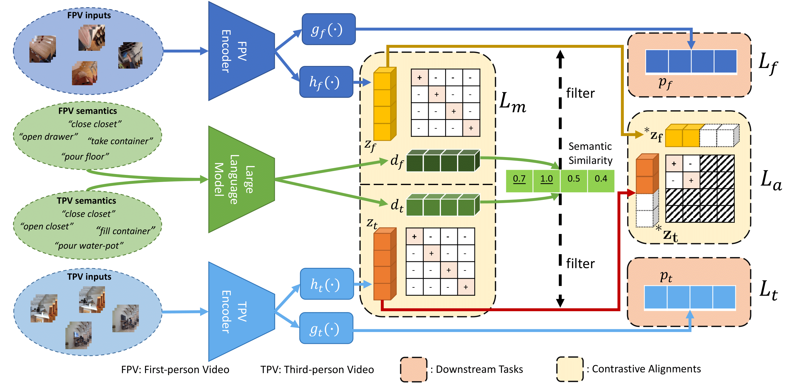

# Learning from Semantic Alignment between Unpaired Multiviews for Egocentric Video Recognition (accepted by ICCV-2023)
This repository holds the Pytorch implementation of "Learning from Semantic Alignment between Unpaired Multiviews for Egocentric Video Recognition" by Qitong Wang, Long Zhao, Liangzhe Yuan, Ting Liu, Xi Peng. 

## Overview of our SUM-L
<div align="center">
  
</div>

## Requirements

```
pip install -r requirements.txt
```
## Datasets

### Epic-Kitchen-55

1. Download the RGB frames from [EPIC Kitchens 55](https://epic-kitchens.github.io/2019).

2. Download the *frame list* from the following links: ([train](https://dl.fbaipublicfiles.com/ego-exo/dataset_split_files/epic_55_split/EPIC_train_action_labels.pkl), [val](https://dl.fbaipublicfiles.com/ego-exo/dataset_split_files/epic_55_split/EPIC_val_action_labels.pkl), [trainval](https://dl.fbaipublicfiles.com/ego-exo/dataset_split_files/epic_55_split/EPIC_train_val_action_labels.pkl). Note that the train/val split is following [temporal-binding-network](https://github.com/ekazakos/temporal-binding-network)

Please set `DATA.PATH_TO_DATA_DIR` to point to the folder containing the frame lists, and `DATA.PATH_PREFIX` to the folder containing RGB frames. For example, we set the symlinks as follow:

```
mkdir -p data/epic-55/split
ln -s /path/to/epic-kitchen-55/rgb_extracted/train data/epic-55/train_rgb_frames
ln -s /path/to/ego-exo/dataset_split_files/epic_55_split/ data/epic-55/split
```
Note: in order to reproduce our results on Epic-Kitchen-100, you have to download Epic-Kitchen-55 dataset, since Epic-Kitchen-100 extends EPIC-Kitchens to 100 hours.

### Epic-Kitchen-100

1. Download the RGB frames and annotations from [EPIC Kitchens 100](https://github.com/epic-kitchens/epic-kitchens-100-annotations).

2. Please set `DATA.PATH_TO_DATA_DIR` to point to the folder containing the frame lists, and `DATA.PATH_PREFIX` to the folder containing RGB frames. For example, we set the symlinks as follow:

```
mkdir -p data/epic-100/
ln -s  /path/to/EPIC-KITCHENS-100 data/epic-100/dataset
ln -s /path/to/epic-kitchens-100-annotations data/epic-100/annotations
```

### Testing our trained weights on Epic-Kitchen-100:

```
CUDA_VISIBLE_DEVICES=0,1,2,3 python -m torch.distributed.launch --nproc_per_node 4 --master_port 23393 tools/run_net.py --cfg configs/epic-kitchen-100/Ego_Exo_SLOWFAST_8x8_R101.yaml TRAIN.CHECKPOINT_FILE_PATH ckpts/EE_EP100_SF101_checkpoint_epoch_00030.pyth
```
Note: you might notice there are some "extra" parameters when you load our model. These are from the third-person video backbone and the network of our proposed method. During the testing phase, we only need parameters from the first-person video backbone.
 
Codebase References:

https://github.com/facebookresearch/Ego-Exo/tree/main

https://github.com/facebookresearch/SlowFast

More code and pre-trained weights will be released soon. Please stay tuned. :)

If you find our code or paper useful in your research, please consider citing:

```
@InProceedings{Wang_2023_ICCV,
    author    = {Wang, Qitong and Zhao, Long and Yuan, Liangzhe and Liu, Ting and Peng, Xi},
    title     = {Learning from Semantic Alignment between Unpaired Multiviews for Egocentric Video Recognition},
    booktitle = {Proceedings of the IEEE/CVF International Conference on Computer Vision (ICCV)},
    month     = {October},
    year      = {2023},
    pages     = {3307-3317}
}
```
